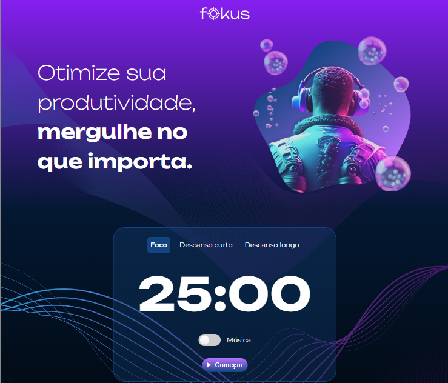

# Projeto Fokus

Esse projeto é inspirado na técnica Pomodoro, que visa a concentração em tarefas importantes. Dessa forma, concentramo-nos em uma atividade por 25 minutos, por exemplo, e após esse período, é possível pausar por 5 minutos ou optar por uma pausa mais longa de 15 minutos.

## 📸 Fotografia

## 🔨 Funcionalidades do projeto

### O usuário será capaz de:
- Escolher entre as opções: Foco, Descanso curto ou Descanso longo.
- Ao apertar o botão "Começar", iniciará a contagem regressiva e ao selecionar novamente o botão, irá pausar a contagem.
- Poderá iniciar ou parar a música.

## ✔️ Tecnologias utilizadas

- `HTML5`
- `CSS3`
- `JavaScript`

## 💻 Link do projeto

Aqui você pode [acessar o Fokus](https://) !!
